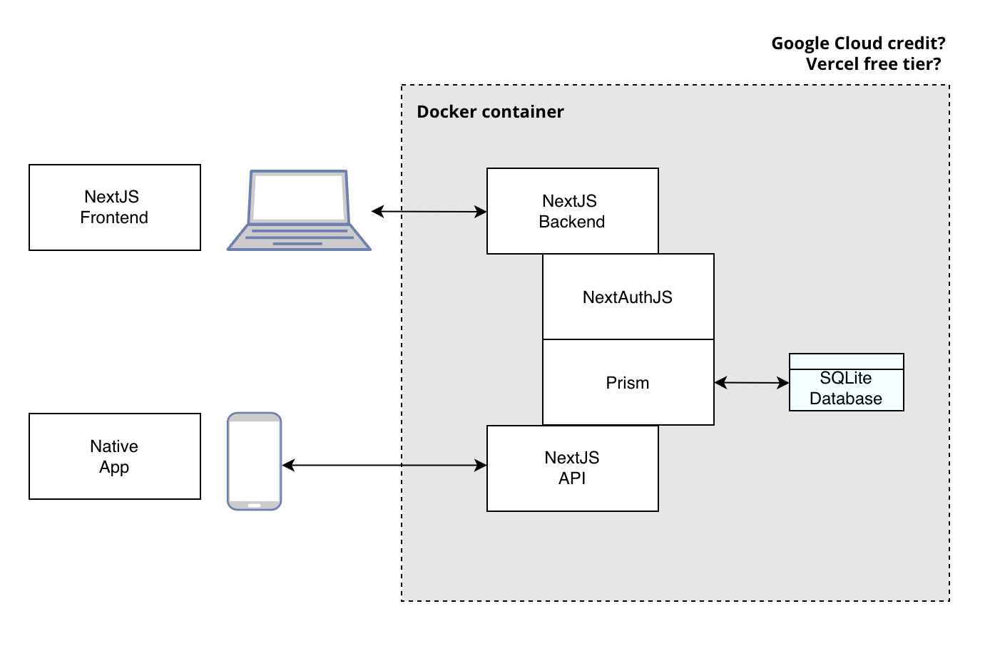

# 🔐🗒️🤓 Securenote 3 🔐🗒️🤓

An experimental implementation of Securenote in NextJS. 

## Funktionalitets TODO
- ~~Endpoints skal kobles på DB~~
- ~~API skal kobles på frontend~~
- ~~Fortsat med form til ny note~~
- ~~Når jeg sletter, så forsvinder den ikke fra cache~~
- ~~http://localhost:3000/notes/41 giver 404, så skal den ikke vise Loading...~~
- ~~Slet Entra~~
- ~~Lav http://localhost:3000/api-example~~
- ?? Tilføj relevant delemekanisme??
- Auth skal sættes på de relevente routes: 
http://localhost:3000/notes
http://localhost:3000/notes/new
http://localhost:3000/db-demo
- Unit tests
- Deploy - Vercel eller GCloud? 
- Avancerede tests
- CD/CI & DevOps

## Sikkerheds TODO
- ... ? 
- ... ?

## Development process

I made initial research on NextJS by talking to a GPT about it and about the NextJS assignement. I asked a lot of questions about authentication, persistence, ORMs and authorisation. I ended up with the following technology stack:

- NextJS for both frontend, backend and RESTful API.
- NextAuthJS for authentication and authorisation. 
- SQLite for database.
- Prisma for ORM.
- Typescript (bvadr) as language. 

## Project plan 

I wanted to find a suited boilerplate app, but unfortunately, I could not find a good match. 

So I am manually bootstrapping the project instead.

1. [Beggining with a Next Auth JS](https://next-auth.js.org/getting-started/example)
2. [Setting up Prism with SQLite](https://www.prisma.io/docs/guides/nextjs)
3. [Building the API part](https://nextjs.org/blog/building-apis-with-nextjs)
4. Adding the UI
5. Making ends meet 

## Software architecture



Here is the current draft for the architecture. ([Link](https://online.visual-paradigm.com/app/diagrams/#diagram:proj=0&id=3&type=ArchiMateDiagram&width=11&height=8.5&unit=inch))

## Noter
Jeg har delvist genereret, delvist kodet projektet. Disse trin har jeg været igennem:

➡️ Bootstrapper Next Auth med et eksempelprojekt som beskrevet på https://next-auth.js.org/getting-started/example 

Jeg kloner eksempel-app:
https://github.com/nextauthjs/next-auth-example 

````

git clone https://github.com/nextauthjs/next-auth-example.git\
cd next-auth-example\
cp .env.local.example .env.local\
npm install

````

➡️ Jeg laver en secret til brug i env.local for prisma 
````
openssl rand -hex 32
````

➡️ Sådan kan jeg åbenbart køre en NextJS app i dev mode
````
npm run dev
````

➡️ Så tilføjer jeg Prisma som ORM som beskrevet i tutorialen https://www.prisma.io/docs/guides/nextjs 


````
npm install prisma --save-dev\
npm install tsx --save-dev\
npm install @prisma/extension-accelerate
npm install sqlite3
npx prisma init --datasource-provider sqlite
````

➡️ Jeg begynder at bygge modellen efter tutorialen 

````
npx prisma migrate dev --name init
npx prisma generate
npx prisma db seed
npx prisma studio
npm run dev
mkdir -p lib && touch lib/prisma.ts
npm run dev
````

Se også https://www.prisma.io/docs/orm/reference/prisma-cli-reference.

➡️ Jeg begynder at bygge modellen efter tutorialen

Når jeg bygger API'en med [Building the API part](https://nextjs.org/blog/building-apis-with-nextjs), så hjælper Postman med testing. Her kan jeg bl.a. sende POST og DELETE requests. 


## API Endpoints Documentation

- **GET /api/notes** --> Fetch all notes.
- **POST /api/notes** --> Create a new note.
- **PUT /api/notes/[id]** --> Update an existing note.
- **DELETE /api/notes/[id]** --> Delete an existing note.

## Tailwind styling
Se på (link)[https://flowbite.com/docs/components/forms/]